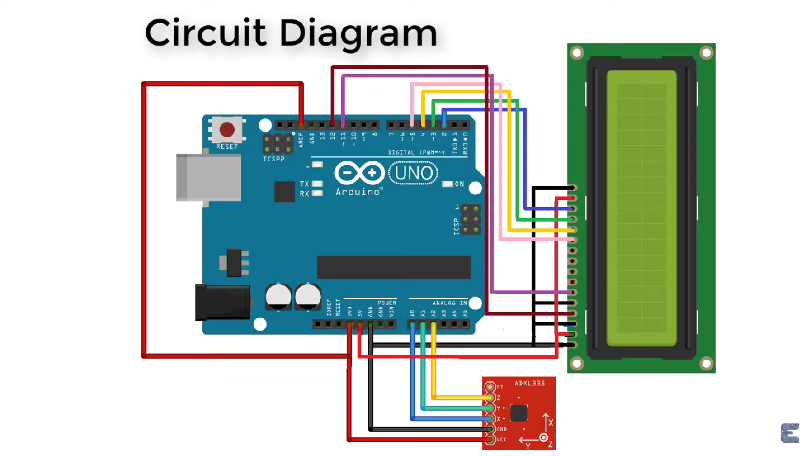

# Integrated Ground Assessment System

## Table of Contents

- [Introduction](#introduction)
- [Project Description](#project-description)
- [Installation](#installation)
- [Usage](#usage)
- [Code Overview](#code-overview)

## Introduction

Welcome to the Integrated Ground Assessment (IGA) project! This project is designed to provide a comprehensive ground profile assessment system. The IGA system combines laser scanners for precise topographic data acquisition and inclinometers to measure tilt and accurately assess gradients.

The main objective of the IGA project is to offer a versatile tool for ground assessment, which can be applied to various domains, including construction, agriculture, robotics, and more.

## Project Description

The Integrated Ground Assessment project is a hardware and software solution that provides precise ground profile assessment. It uses a combination of laser scanners and inclinometers to achieve this goal. The provided code is for an Arduino-based system that reads sensor data, calculates angles of inclination, and indicates the assessment results using LEDs.

## Installation

To set up the Integrated Ground Assessment system, follow these steps:

1. **Hardware Setup**: You will need appropriate sensors, an Arduino board, and LEDs. Connect the sensors and LEDs to the Arduino according to the pin assignments in the code (greenLED, yellowLED, redLED).

2. **Software Setup**:
   - Make sure you have the Arduino IDE installed.
   - Open the provided Arduino code in the Arduino IDE.
   - Upload the code to your Arduino board.

## Usage

To use the Integrated Ground Assessment system, follow these instructions:

1. Ensure that the system is set up and the code is uploaded to the Arduino board.

2. Power on the system.

3. The LEDs will indicate the ground assessment results based on the inclination angles:
   - Green LED: Ground is relatively level (angles less than 15 degrees).
   - Yellow LED: Ground is moderately inclined (angles less than 30 degrees).
   - Red LED: Ground is steeply inclined (angles greater than or equal to 30 degrees).

4. Interpret the LED indicators for your specific application.

## Code Overview

The provided Arduino code reads sensor data from the inclinometer, calculates the angles of inclination, and controls the LEDs based on these angles. The code includes functions to map analog sensor readings to g-values and calculate angles.

- `setup()`: Initializes the system by configuring pins and setting up the LEDs.

- `loop()`: The main loop that reads sensor data, calculates angles, and controls the LEDs based on the inclination angles.

- `mapf()`: A custom mapping function for floating-point numbers.

For debugging purposes, you can uncomment the serial print statements to see the sensor data and calculated angles.

